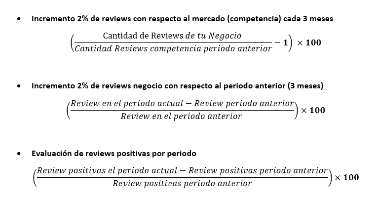

# Proyecto-Final-Google-Yelps
## OpportUnity Team

## Integrantes y Roles

* Thomas Bracamonte: Data Engineer.
* Tomas Feiertag: Data Engineer.
* Valentin Testa: Data Analyst.
* Francisco Iturriaga: Data Analyst.
* Pablo Cesar: Machine Learning Ops.

## Misión
Nuestro propósito es ofrecer soluciones innovadoras impulsadas por la ciencia de datos, adaptándonos a las necesidades únicas de cada cliente para generar resultados medibles y estratégicos.

## Visión
Ser líderes en la creación de soluciones inteligentes y personalizadas a través del poder de los datos, transformando la manera en que las empresas toman decisiones estratégicas y logrando un impacto positivo en sus resultados.

## Valores
Innovación continua: Nos desafiamos constantemente a explorar nuevas tecnologías y enfoques disruptivos que impulsen el cambio.

Centrados en el cliente: Escuchamos activamente a nuestros clientes para anticipar sus necesidades y crear experiencias personalizadas y transformadoras.

Data-driven: Tomamos decisiones impulsadas por datos sólidos, buscando siempre soluciones inteligentes y eficientes.

Transparencia radical: Priorizamos la honestidad y la claridad en cada paso, asegurando que nuestros clientes comprendan el valor de cada dato y decisión.

Cultura colaborativa: Creemos en la sinergia de equipos diversos y la co-creación con nuestros clientes para lograr innovación real.

Responsabilidad social: Reconocemos el impacto de la tecnología en la sociedad y nos comprometemos a un uso ético y responsable de los datos.

Agilidad: Somos flexibles y rápidos para adaptarnos a los cambios del entorno y responder a las nuevas oportunidades del mercado.

## Contexto
Un inversor nos contrató para realizar un análisis de mercado y ofrecerle diferentes propuestas de negocios para invertir su capital en la ciudad de Filadelfia, USA. Usaremos reseñas obtenidas de Yelp y Google maps, para determinar el mejor rubro y las mejores ubicaciones para nuevos locales.

## Alcance
Nos enfocamos en la ciudad de Filadelfia (EE.UU),  entre 2015 y 2022.

### Objetivos Específicos
Utilizando herramientas tecnológicas basadas en ciencia de datos, proponemos realizar un análisis riguroso para sugerir las áreas de inversión más favorables, mediante un sistema predictivo que detecte patrones a partir de datos clave del mercado.

### KPI's

## Stack Tecnológico

### Lenguajes de programación
Python

### Control de Versiones y Colaboración
Git y Github

### Entornos de desarrollo y edición de Código
Visual Studio Code y Jupyter

### Análisis y visualización de los datos
Pandas, NumPy, Matplotlib, Seaborn, Power BI

### Procesamiento de lenguaje natural
NLTK

## Aprendizaje Automático
Scikit-learn

### Plataformas de Computación en la nube
Google Cloud, BigQuery
 
## Orquestación y Automatización de flujos
Airflow, Google Functions, Google Scheduler

## Desarrollo de Aplicaciones Web
Streamlit

## Análisis Exploratorio de Datos 
### Distribución de negocios top 12 ciudades (Yelps)

### Top 20 categorias mas comunes (Google Maps)

## Diagrama de Gantt

