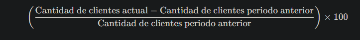
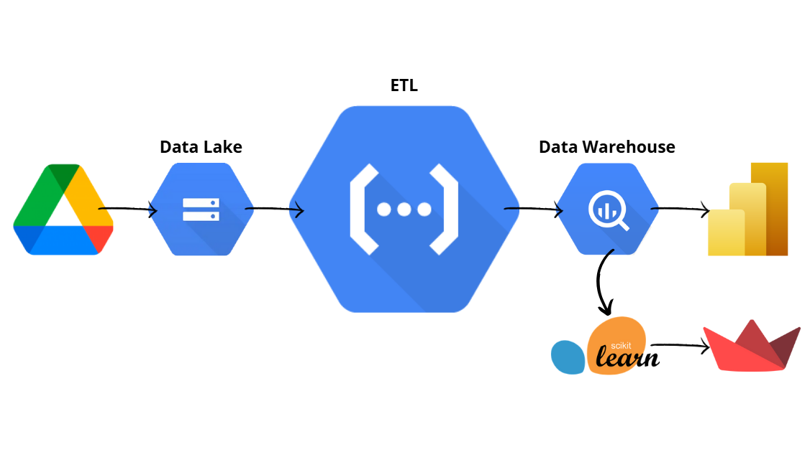

# Proyecto-Final-Google-Yelps

## OpportUnity Team

<!-- TABLA DE CONTENIDO -->

## ¿Quiénes Somos?
1. [Integrantes](#integrantes-y-roles)
2. [Misión](#misión)
3. [Visión](#visión)
4. [Valores](#valores)

## Proyecto Salford-Filadelfia
1. [Objetivos Específicos](#objetivos-específicos)
2. [Stack Tecnológico](#stack-tecnológico)
3. [Diagrama Gantt](#diagrama-de-ganttproject-division-de-tareas-claras)
4. [EDA](#análisis-exploratorio-de-datos)
5. [MODELO ML](#modelo-machine-learning)
6. [KPI's](#key-performance-indicators-kpis)
7. [Datasets](#datasets-y-fuentes-complementarias)
8. [Estructura](#estructura-del-proyecto)

<!-- PARTE INTEGRANTES Y ROLES -->

## Integrantes y Roles

* Thomas Bracamonte: Data Engineer.
* Tomas Feiertag: Data Engineer.
* Valentin Testa: Data Analyst.
* Francisco Iturriaga: Data Analyst.
* Pablo Cesar: Machine Learning Ops.

<!-- INTRODUCCION -->

## Misión

Nuestro propósito es ofrecer soluciones innovadoras impulsadas por la ciencia de datos, adaptándonos a las necesidades únicas de cada cliente para generar resultados medibles y estratégicos.

## Visión

Ser líderes en la creación de soluciones inteligentes y personalizadas a través del poder de los datos, transformando la manera en que las empresas toman decisiones estratégicas y logrando un impacto positivo en sus resultados.

## Valores

*Innovación continua*: Nos desafiamos constantemente a explorar nuevas tecnologías y enfoques disruptivos que impulsen el cambio.

*Centrados en el cliente*: Escuchamos activamente a nuestros clientes para anticipar sus necesidades y crear experiencias personalizadas y transformadoras.

*Data-driven*: Tomamos decisiones impulsadas por datos sólidos, buscando siempre soluciones inteligentes y eficientes.

*Transparencia radical*: Priorizamos la honestidad y la claridad en cada paso, asegurando que nuestros clientes comprendan el valor de cada dato y decisión.

*Cultura colaborativa*: Creemos en la sinergia de equipos diversos y la co-creación con nuestros clientes para lograr innovación real.

*Responsabilidad social*: Reconocemos el impacto de la tecnología en la sociedad y nos comprometemos a un uso ético y responsable de los datos.

*Agilidad*: Somos flexibles y rápidos para adaptarnos a los cambios del entorno y responder a las nuevas oportunidades del mercado.

<!-- PROYECTO SALFORD-FILADELFIA -->

# Proyecto Salford-Filadelfia

<!-- Contexto -->

## Contexto
Un inversor nos contrató para realizar un análisis de mercado y ofrecerle diferentes propuestas de negocios para invertir su capital en la ciudad de Filadelfia, USA. Usaremos reseñas obtenidas de Yelp y Google maps, para determinar el mejor rubro y las mejores ubicaciones para nuevos locales.

<!-- Alcance -->

## Alcance
El enfoque de nuestro alcance es toda el área comercial que hay en la ciudad de Filadelfia (EE.UU),  entre 2015 y 2022.

<!-- Objetivos Especificos -->

## Objetivos Específicos
Utilizando herramientas tecnológicas basadas en ciencia de datos, proponemos realizar un análisis riguroso para sugerir las áreas de inversión más favorables, mediante un sistema predictivo que detecte patrones a partir de datos clave del mercado.

1. Recopilar datos
    * Extraer y limpiar los datos de Yelp y Google Maps.
    * Integrar estos datos en un Data Warehouse que permita el acceso y manipulación de grandes volúmenes de datos.

2. Análisis Exploratorio de Datos (EDA)
    * Realizar un EDA completo para identificar las principales categorías de negocio y ubicaciones más frecuentadas.
    * Evaluar la distribución geográfica y demográfica de los locales comerciales en Filadelfia.
    * Analizar las puntuaciones y reseñas para obtener insights sobre la satisfacción de los clientes.

3. Modelado Predictivo
    * Desarrollar un modelo de machine learning que permita predecir la viabilidad de nuevas inversiones en función de variables clave como ubicación, categoría de negocio y puntuaciones de reseñas.
    * Aplicar técnicas de procesamiento de lenguaje natural (NLP) para extraer información valiosa de las reseñas, identificando tendencias y opiniones comunes de los usuarios.
4. Propuesta de Inversión

    * Proporcionar un informe detallado con recomendaciones basadas en los análisis realizados, identificando las mejores oportunidades de inversión en la ciudad de Filadelfia.
    * Desarrollar un sistema de visualización de datos que permita a los inversores interactuar con las predicciones y análisis, facilitando la toma de decisiones estratégicas.

<!--  KPI -->

## KPI's
1. **Variación de la calificación promedio de estrellas (%)**:

   

2. **Comparación de reviews con la competencia (%)**:

   

3. **Crecimiento de la base de clientes (%)**:

   

<!-- STACK TECNOLOGICO -->

## Stack Tecnológico

### Lenguajes de programación
 Python 

### Control de Versiones y Colaboración
 Git  Github

### Entornos de desarrollo y edición de Código
 Visual Studio Code 
 Jupyter

### Análisis y visualización de los datos
 Pandas 
 NumPy 
 Matplotlib 
 Seaborn 
 Power BI

### Procesamiento de lenguaje natural
 NLTK

### Aprendizaje Automático
 Scikit-learn

### Plataformas de Computación en la nube
 Google Cloud 
 BigQuery
 
## Orquestación y Automatización de flujos 
 Google Functions 
 Google Scheduler

## Desarrollo de Aplicaciones Web
 Streamlit

<!-- DIAGRAMA GANTT -->

## Diagrama de GanttProject (Division de tareas claras)

## Diagrama hecho en Asana (A quien se le asigna cada tarea)

<!-- PIPELINE -->

## Pipeline

<!-- ANALISIS EXPLORATORIO DE DATOS -->

## Análisis Exploratorio de Datos 
### Distribución de negocios top 12 ciudades (Yelps)

### Top 20 categorias mas comunes (Google Maps)

<!-- MODELO ML -->

## Modelo Machine Learning

- [Modelo Machine Learning](https://pfappapp-cspnibhve4hyda4hv7mkzs.streamlit.app/)

<!-- DATASETS Y FUENTES COMPLEMENTARIAS -->

## Datasets y fuentes complementarias 

Los datos son extraídos de la plataforma de reseñas **Yelp** y de **Google Maps**, para **Estados Unidos**. Tiene información sobre la ubicación de los comercios, su categoría, puntajes promedios, si están abiertos o no, sobre los usuarios, las reseñas que hicieron, cuántas reseñas hicieron, cuántos votos han recibido esas reseñas, entre otros. Se puede complementar el análisis con datasets adicionales que ofrezcan información que se considere pertinente al pedido (valores de acciones de las empresas, información geográfica adicional de los locales, etc). Recomendamos fuertemente el uso de **NLP** para procesar la información de las reseñas.

### Diccionario de Datos

- [Diccionario de Datos](https://docs.google.com/document/d/1wp87RQDi-Qv1rIYS5CRFyrhT0XSjsl6IxVqsItqPHKc/edit?usp=sharing)

### Fuentes de datos:

- [Dataset de Google Maps](https://drive.google.com/drive/folders/1Wf7YkxA0aHI3GpoHc9Nh8_scf5BbD4DA?usp=drive_link)
- [Dataset de Yelp](https://drive.google.com/drive/folders/1TI-SsMnZsNP6t930olEEWbBQdo_yuIZF?usp=drive_link)

## Presentaciones

- [Demo 1](https://view.genially.com/66e3ba6323483daa2b09b4b3/dossier-opportunity-demo-1)
- [Demo 2](https://view.genially.com/66e9e7231311c2e19a16d0a6/dossier-opportunity-demo-2)
- [Demo 3]()

<!-- ESTRUCTURA DEL PROYECTO -->

## Estructura del Proyecto
* Data/ : Contiene los archivos de datos utilizados en el proyecto
* Notebooks/ : notebooks de Jupyter con el análisis y modelos.
* ETL/ : notebooks de Jupyter con el trabajo sobre los datos.
* ML / : el modelo de ML

-----
-----
-----